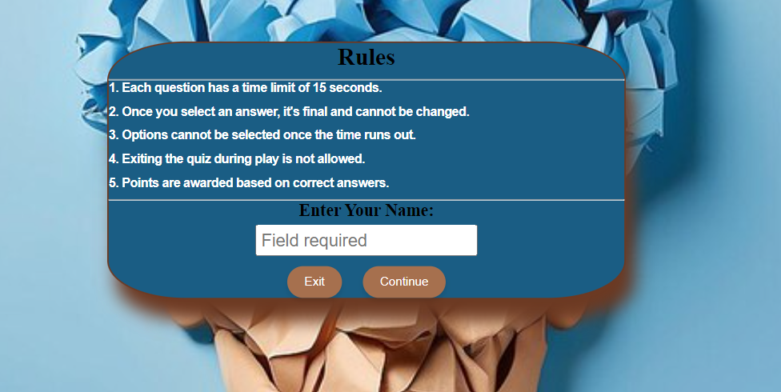
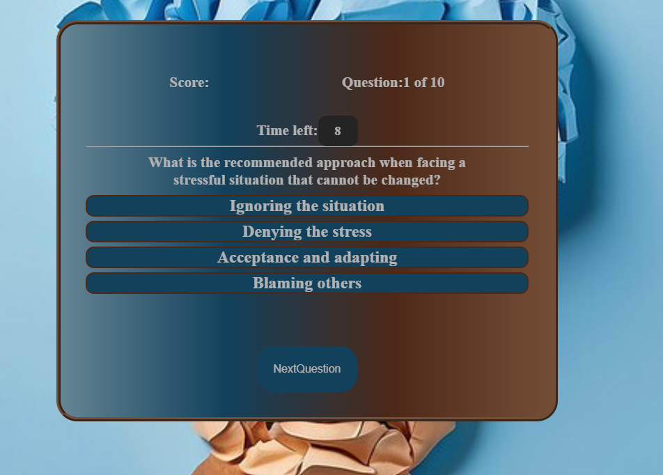
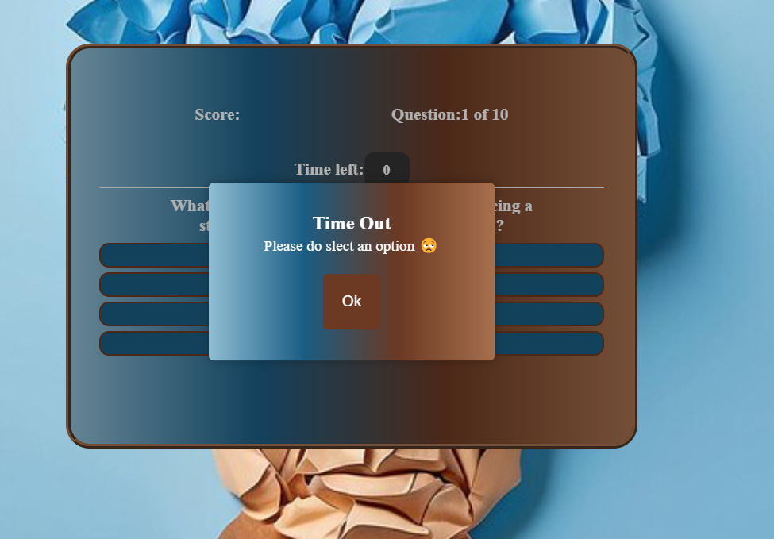
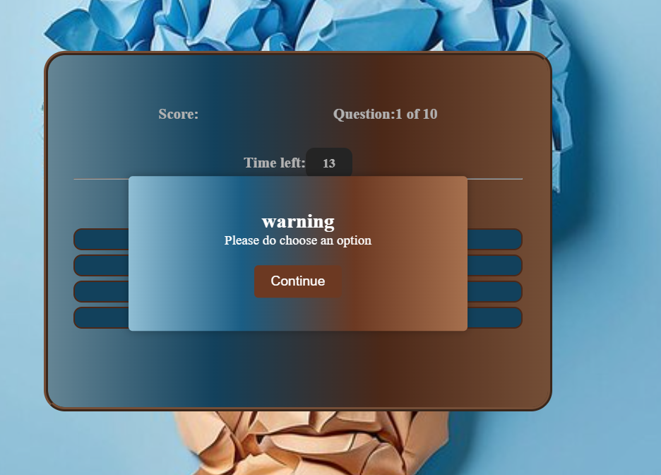
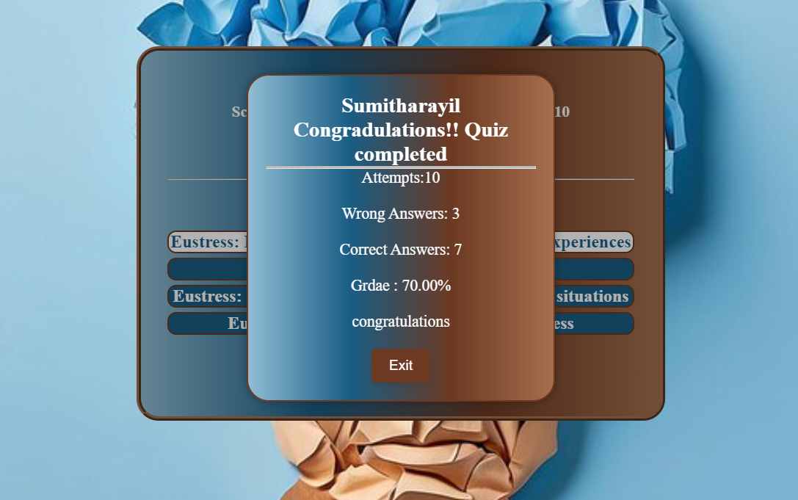
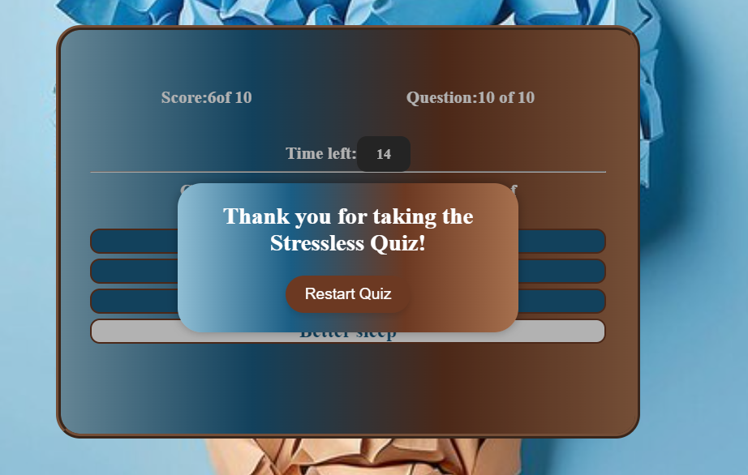
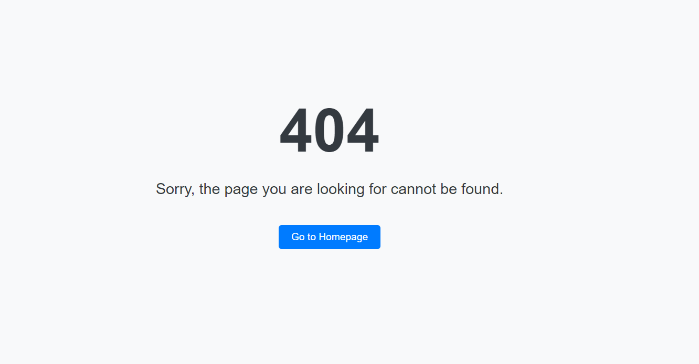
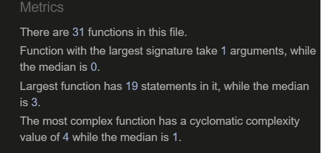

# stresslessquiz

This project is a part of a resubmission of the project [ https://ci-sumi.github.io/stress-free-living-quiz/].
The project has been redeployed with the new changes.

## Project Overview
Stressless Quiz is an online quiz designed for individuals looking to understand and manage stress better.
The quiz offers users the opportunity to explore challenging questions related to the nature of stress, its causes, and effective stress management techniques.
The primary goal of Stressless Quiz is to increase awareness about stress and its impact on health and well-being. 
By catering to users of all ages, the quiz aims to provide both education and practical insights, encouraging users to explore more about stress management strategies and promote mental health.

You can check out the [live website ](https://ci-sumi.github.io/stresslessquiz/)

Feel free to check out the [GitHub Repository](https://github.com/ci-sumi/stresslessquiz.git)

### Table of Contents
   [Site Owner Goals](#site-owner-goals)
   * [User Stories](#user-stories)
     + [First Time User](#first-time-user)
     + [Returning User](#returning-user)
     + [Frequent User](#frequent-user)
   * [Design](#design)
     + [Imagery](#imagery)
     + [Color Scheme](#color-scheme)
     + [Typography](#typography)
     + [Layout](#layout)
     + [Wireframes](#wireframes)
   * [Features](#features)
     + [Home Page](#home-page)
     + [Rule Box](#rule-box)
     + [Quix Box](#quiz-box)
     + [Result Box](#result-box)
     + [General Features](#general-features)
     + [Future Implementation](#future-implementation)
   * [Testing](#testing)
     + [Validator Testing](#validator-testing)
       + [HTML](#html)
       + [CSS](#css)
       + [Javascript](#javascript)
     + [ Accessibility](#accessibility)
     + [Button Testing](#button-testing)
     + [Comprehensive Game Testing](#comprehensive-game-testing)
     + [Rigorous Browser Testing](#rigorous-browser-testing)
     + [Comprehensive Device Testing](#comprehensive-device-testing)
     + [Fixed Bugs](#fixed-bugs)
     + [Known Bugs](#known-bugs)

   * [Technologies](#technologies)
     + [Languages](#languages)
     + [Libraries and Programs Used](#libraries-and-programs-used)

   * [Deploy with GitHub Pages](#deploy-with-github-pages)
   * [Cloning](#cloning)
   * [Content](#content)
     + [Credits](#credits)
     + [Media](#media)
     + [Resources Used](#resources-used)
   * [Acknowledgements](#acknowledgements)

   
## Site Owner Goals

- **Engaging Quiz Experience** : Provide an interactive quiz with educational content about stress, fostering user engagement and learning.

- **Visually Appealing and Accessible:** Ensure the quiz is attractive, user-friendly, and responsive across all devices.

- **Motivate Quick Completion:** Encourage timely quiz completion and motivate users to improve their performance with each attempt.

- **Interactive User Experience:** 
Require users to enter their name before starting the quiz to personalize the experience and increase engagement.

## User Stories

### First Time User
As a first-time user, I want to assess my stress levels through an engaging and informative quiz.

As a first-time user, I hope to navigate the quiz effortlessly, understanding its features and presented information.

As a first-time user, I desire a dynamic and enjoyable experience, feeling motivated to complete the quiz and learn from the results.

I want to input my name at the start to personalize the experience and make it more attractive.

### Returning User  
As a returning user, I want to easily resume the quiz from where I left off without any hassle.

As a returning user, I want to see new or randomized questions each time to keep the quiz fresh and engaging.

As a returning user, I want to be motivated by a dynamic and enjoyable quiz experience that encourages me to improve my performance with each attempt.

### Frequent User
As a frequent user, I want the option to review past quiz results easily to track my progress and improvement over time.

## Design

### Imagery
 llustration of a brain, symbolizing the mental impact of stress. The brain appears strained or overwhelmed, reflecting the challenges individuals face when dealing with stress. This imagery underscores the importance of stress management and mental well-being.

### Color Scheme
The color scheme was generated using an uploaded brain image in Casava.[Canva](https://www.canva.com/colors/color-palette-generator/)

 color theme draws inspiration from soothing natural elements and warm, earthy tones, creating a welcoming and calming atmosphere for users to engage with stress management content.

 These colors create a harmonious and inviting visual environment, fostering a positive and empowering experience for users as they engage with the stressless quiz application.

### Typography

### Layout
- Start Area

   + Purpose: Welcome users and initiate the quiz experience.

- Info Box
 
   + Purpose: Provide users with information about the quiz rules.
   + Components: Input field to collect user's name.

- Quiz Box
  
   + Purpose: Engage users in the quiz experience, allowing them to test their stress management knowledge.
   
   + Components:
   
     + Quiz questions presented one at a time.
     + Timer to add a sense of urgency.
     + Pop up when time is over
     + Prompt if user attempts to proceed without selecting an answer.
     + Shows score and question number.
    
- Result Box
  
  + Purpose: Display the user's quiz results and provide feedback.

  + Components:
     
     + Display the user's name.
     + Number of correct answers.
     + Number of incorrect answers.
     + Personalized message based on the score.
     + Option to exit result box.

- Thank You Box
  
  + Purpose: Express gratitude to the user for participating in the quiz.

  + Components:
     + Thank you message.
     + Option to restart the quiz.

- Timeout Message 

   + Purpose: Notify users if they run out of time while answering a question.
   + Components:
       + Timeout message.
       + Option to continue the quiz.

 

### Wireframes

Wireframe

 Wireframes are created using [Balsamiq](https://balsamiq.com/)

 
 
 
 
 
 
 

 

 ## Features

 ### Home Page
 The home page of the Stressless Quiz welcomes users with a title "StresslessQuiz"and with calming design, featuring a soothing color palette inspired by an image of a brain symbolizing stress relief.

 A prominent "Start Quiz" button invites users to begin their journey towards understanding and managing stress better.

 A minimalistic footer displays a copyright notice.

### Rule Box
The rule box contains the rules of the quiz and includes an input field where users must enter their name. This input is compulsory for users to proceed with the quiz.
There is a "Continue" button for users to proceed to the quiz after entering their name.
An "Exit" button allows users to go back to the start page if they choose not to continue.

## Quiz Box
The quiz box is where the main action happens, containing a series of stress-related questions to test the user's knowledge.

Each question is presented with four multiple-choice options, allowing users to select their answer.

A score board is included to display the user's current score, showing how many questions they have answered correctly.

The current question number is prominently displayed, indicating the user's progress through the quiz (e.g., "Question 3 of 10").

A timer counts down for each question, adding a sense of urgency. If the timer runs out before an answer is selected, a timeout message will be displayed, and the user will be prompted to proceed to the next question.

After selecting an answer, users can click the "Next Question" button to proceed to the next question. If a user attempts to proceed without selecting an option, they will be prompted to make a selection before continuing.

## Result Box

The result box appears at the end of the quiz, summarizing the user's performance.

It displays the user's name, total correct answers, total wrong answers, and a percentage grade.

A congratulatory message or encouragement to keep practicing is shown based on the user's score.

Users can choose to restart the quiz from here or exit to the home page.

### General Features

The website features a responsive design and includes:

Favicon: Carefully chosen to align with the overall theme.

-404 Page not found
 - Created a simple 404.html page to inform users when a page cannot be found
- Included basic styling for better user experience
- Added a link to navigate back to the homepage.

### Future Implementation
 - Personalized Recommendations:After displaying results, provide recommendations based on the user's performance.

 - Professional Resources:Add links or contacts for mental health professionals.

 - Social Media Sharing:Enable users to share their scores on social media.

 ## Testing
  
  ### Validator Testing

  - #### HTML

      - HTML passed through the official W3C Markup Validator without any errors. 
          - [W3 Validator Results](https://validator.w3.org/nu/?doc=https%3A%2F%2Fci-sumi.github.io%2Fstresslessquiz%2F)

 - #### CSS
      - CSS passed through the official W3C CSS Validator without any errors. 
       -[CSS Validator Results](https://jigsaw.w3.org/css-validator/validator?uri=https%3A%2F%2Fci-sumi.github.io%2Fstresslessquiz%2F&profile=css3svg&usermedium=all&warning=1&vextwarning=&lang=en)

 - ### Javascript
    - Js passed through the official Jshint without any errors.
      -[Jshint Validator](https://jshint.com/)
      

 - ### Accessibility 
      - Lighthouse report shows excellent scores for Performance, Accessibility, and Best Practices, each achieving a perfect score of 100. The SEO score is also quite high at 91.
        - [Lighthouse Screenshot](docs/readme_images/lighthouse.png)

- ### Button Testing
   - All buttons, including the 'Start Quiz', answer option buttons, 'Next', 'Submit', and modal control buttons, were manually tested to ensure proper navigation and functionality within the Stressless Quiz application.

- ### Comprehensive Game Testing
   - Conduct a thorough evaluation alongside friends and family to ensure functionality and user satisfaction:
      - Randomize the arrangement of questions and answers to prevent predictability.

      - Validate the cessation of the timer accurately upon user interaction, guaranteeing precise time management during gameplay.

     - Ascertain clear indication of the current question displayed.

     - Assess the effectiveness of visual cues, such as color alterations and shake animations, in providing intuitive feedback to the player.
     - Confirm the accuracy of score tracking mechanisms, including the proper incrementation of incorrect scores when no answer is selected.
- #### Rigorous Browser Testing
   - The website underwent meticulous examination on Google Chrome and Firefox browsers, revealing no noted issues.

- #### Comprehensive Device Testing
  - Extensive testing across various devices, including Desktops, Laptops, iPhone 8, iPhone 11 Pro Max, and Xiaomi Redmi Note 11, ensured responsiveness across diverse screen sizes in both portrait and landscape orientations. Additionally, compatibility assessments were conducted using Chrome developer tools across a spectrum of devices, affirming structural integrity across differing screen dimensions.

  #### Fixed Bugs
   Encountered an issue where my Git commit was failing with an exit code. Despite multiple attempts, the changes were not getting committed. I contacted tutor support(Code Institute) for assistance, and with their help, the problem was identified and resolved by adding a .gitmodules file. This fixed the issue and allowed the commit to succeed.

  #### Known Bugs

## Technologies

### Languages
  - HTML5, CSS, and JavaScript to develop the project.

### Libraries and Programs Used

 - [Am I Responsive](https://ui.dev/amiresponsive) AMI Responsiveness to test and ensure the project's responsiveness across various devices and screen sizes.
 - [Responsinator](http://www.responsinator.com/) Responsinator also used to test and ensure the project's responsiveness.
 - [Balsamiq](https://balsamiq.com/?gad_source=1&gclid=Cj0KCQjw0_WyBhDMARIsAL1Vz8vKZVsIQw0dHc-KprCi3RzVpWpXJ06V3cqTGdn9smwTI_fyrIsOiysaAqUDEALw_wcB)
  Used Balsamiq to create wireframes and prototypes, which helped in visualizing the design and structure of the project before development.
- [Chrome DevTools](https://developer.chrome.com/docs/devtools/) Used Chrome DevTools to debug, test, and optimize the project's performance, ensuring it worked correctly across different devices and screen sizes.

- [Favicon](https://favicon.io/) Added a favicon to the project for better branding and to enhance the user experience.

- [Canva](https://www.canva.com/colors/color-palette-generator/) Used Canva to create color palette.

## Deploy with GitHub Pages
 1. Go to Repository Settings: Navigate to your repository on GitHub, click on the "Settings" tab.
2. Enable GitHub Pages: Scroll down to the "GitHub Pages" section.
3. Source Branch: Select the branch you want to deploy from (usually main or master), and if necessary, specify the folder (e.g., /docs).
4. Save: Click "Save" or "Deploy" to publish your site.

[Live link]( https://ci-sumi.github.io/stresslessquiz/)

## Cloning
- Get Repository URL

  1. Go to GitHub: Open the repository you want to clone in your web browser.

  2. Copy Repository URL: Click on the "Code" button and copy the repository URL (HTTPS or SSH).
- Open Terminal/Command Prompt

  1. Open Terminal/Command Prompt: Navigate to the directory where you want to clone the repository.

- Clone the Repository

  Run Git Clone Command: Use the git clone command followed by the repository URL:

  https://github.com/ci-sumi/stresslessquiz.git

## Credits

  ### Content

 During a period of personal struggle with depression, I unexpectedly discovered a unique source of inspiration. Despite the challenges I faced, the experience led me to develop a stress-relief concept that I'm excited to share.

 ### Media
 Background Image
 - [Brain Image](https://www.freepik.com/premium-ai-image/brain-disorder-symbol-presented-by-human-head-made-from-crumpled-paper-torn-blue-copy-space-background_148184265.htm)

### Resources Used
[W3 Schools](https://www.w3schools.com/)

[Stack Overflow](https://stackoverflow.com/)

[Geeks for Geeks](https://www.geeksforgeeks.org/)

[Youtube chanel](https://www.youtube.com/watch?v=lfmg-EJ8gm4&t=630s)

## Acknowledgements

I would like to express my sincere gratitude to Antonio Rodriguez & Code Institue Tutor help

Special thanks to Rohini A R and Tomislav Dukez for their unwavering encouragement and assistance during various stages of this journey. Their dedication and collaboration have significantly enriched the project.

  

