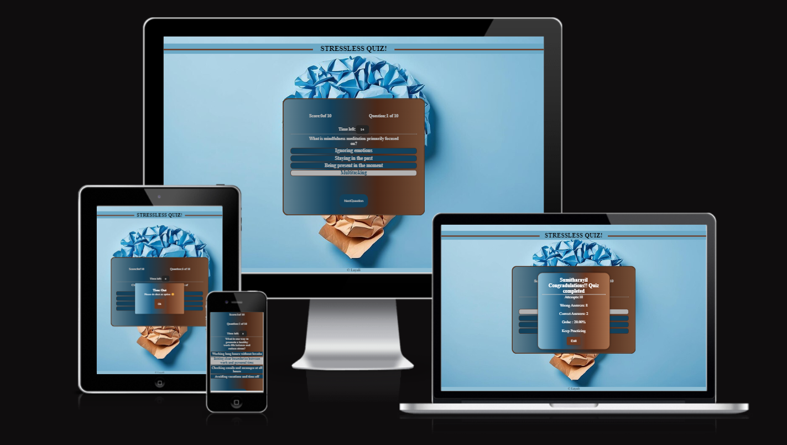
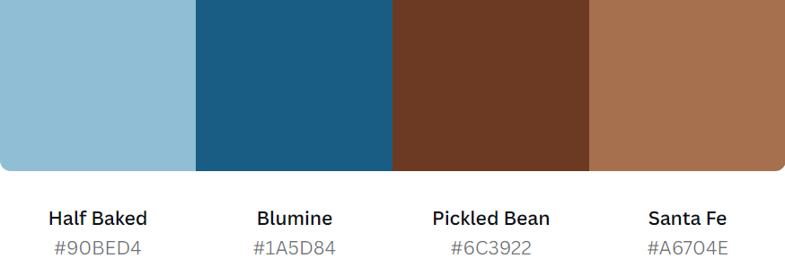
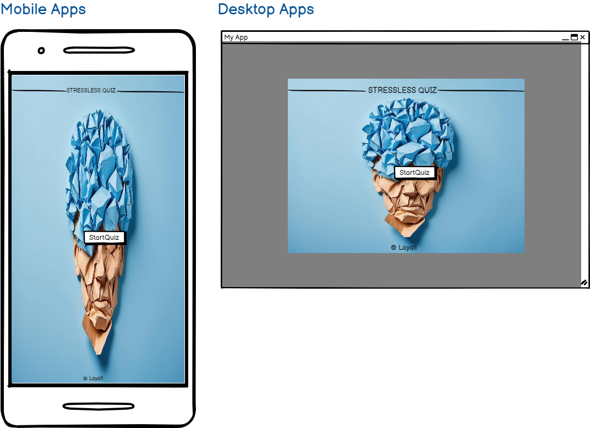
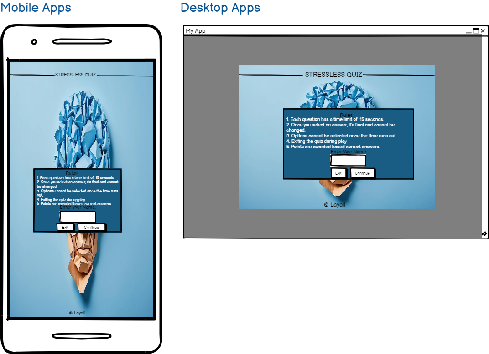
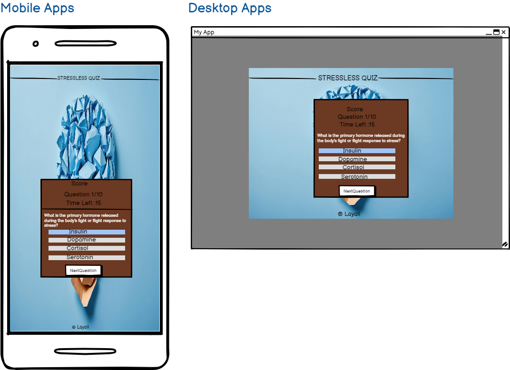
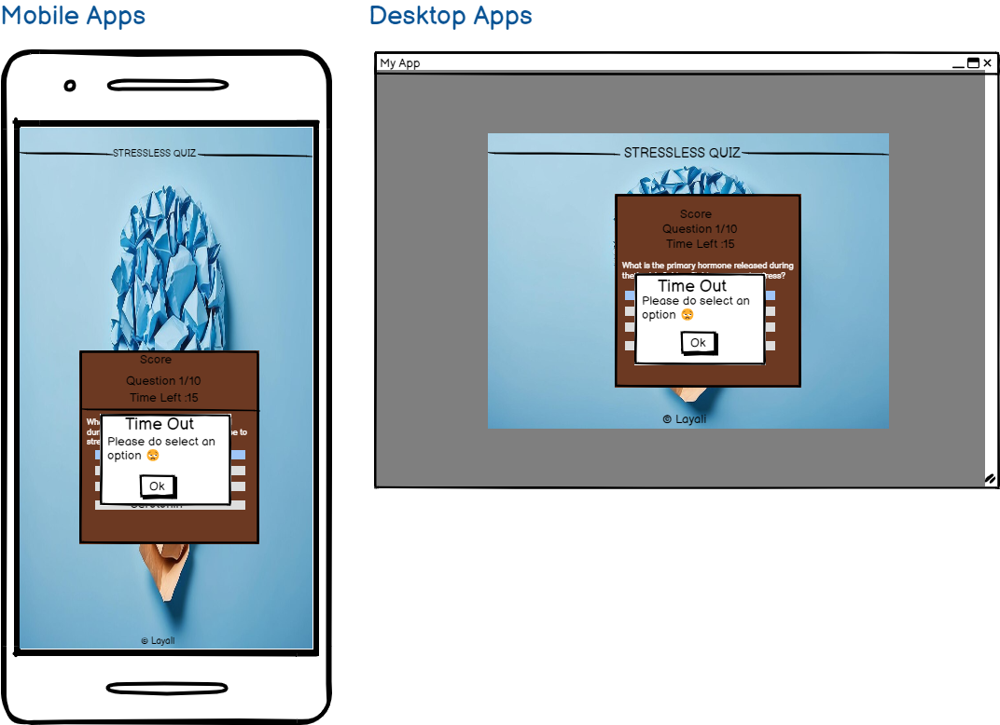
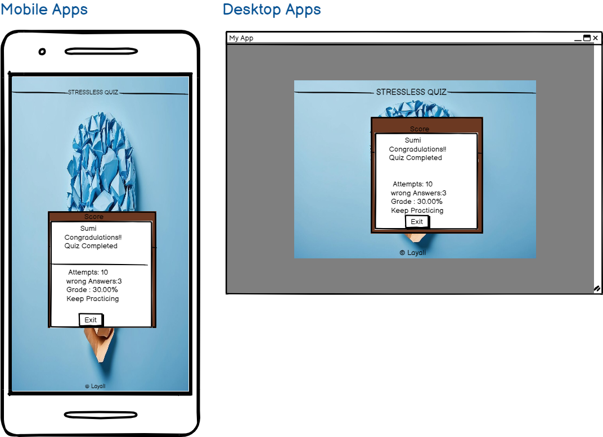
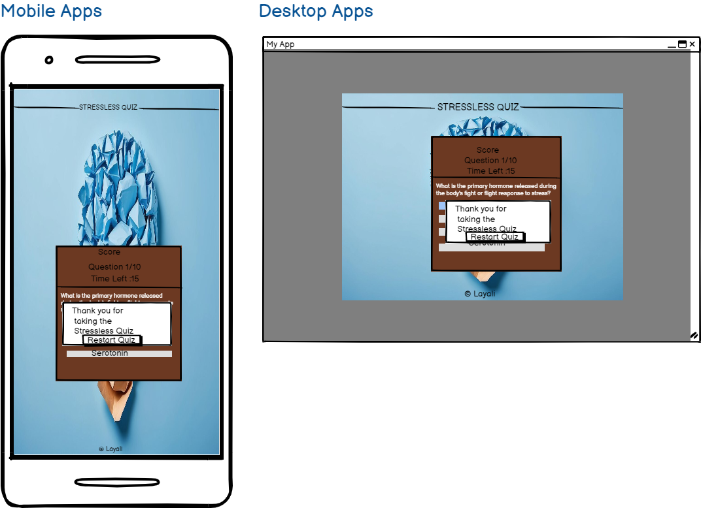

# stresslessquiz

## Project Overview
Stressless Quiz is an online quiz designed for individuals looking to understand and manage stress better.
The quiz offers users the opportunity to explore challenging questions related to the nature of stress, its causes, and effective stress management techniques.
The primary goal of Stressless Quiz is to increase awareness about stress and its impact on health and well-being. 
By catering to users of all ages, the quiz aims to provide both education and practical insights, encouraging users to explore more about stress management strategies and promote mental health.

You can check out the [live website ](https://ci-sumi.github.io/stresslessquiz/)

Feel free to check out the [GitHub Repository](https://github.com/ci-sumi/stresslessquiz.git)

### Table of Contents
   [Site Owner Goals](#site-owner-goals)
   * [User Stories](#user-stories)
     + [First Time User](#first-time-user)
     + [Returning User](#returning-user)
     + [Frequent User](#frequent-user)

## Site Owner Goals

- **Engaging Quiz Experience** : Provide an interactive quiz with educational content about stress, fostering user engagement and learning.

- **Visually Appealing and Accessible:** Ensure the quiz is attractive, user-friendly, and responsive across all devices.

- **Motivate Quick Completion:** Encourage timely quiz completion and motivate users to improve their performance with each attempt.

- **Interactive User Experience:** 
Require users to enter their name before starting the quiz to personalize the experience and increase engagement.

## User Stories

### First Time User
As a first-time user, I want to assess my stress levels through an engaging and informative quiz.

As a first-time user, I hope to navigate the quiz effortlessly, understanding its features and presented information.

As a first-time user, I desire a dynamic and enjoyable experience, feeling motivated to complete the quiz and learn from the results.

### Returning User  
As a returning user, I want to easily resume the quiz from where I left off without any hassle.

As a returning user, I want to see new or randomized questions each time to keep the quiz fresh and engaging.

As a returning user, I want to input my name at the start to personalize the experience and make it more attractive.

As a returning user, I want to be motivated by a dynamic and enjoyable quiz experience that encourages me to improve my performance with each attempt.

### Frequent User
As a frequent user, I want the option to review past quiz results easily to track my progress and improvement over time.

## Design

### Imagery
 llustration of a brain, symbolizing the mental impact of stress. The brain appears strained or overwhelmed, reflecting the challenges individuals face when dealing with stress. This imagery underscores the importance of stress management and mental well-being.

### Color Scheme
The color scheme was generated using an uploaded brain image in Casava.[Canva](https://www.canva.com/colors/color-palette-generator/)

 color theme draws inspiration from soothing natural elements and warm, earthy tones, creating a welcoming and calming atmosphere for users to engage with stress management content.

 These colors create a harmonious and inviting visual environment, fostering a positive and empowering experience for users as they engage with the stressless quiz application.

### Typography

### Layout
- Start Area

   + Purpose: Welcome users and initiate the quiz experience.

- Info Box
 
   + Purpose: Provide users with information about the quiz rules.
   + Components: Input field to collect user's name.

- Quiz Box
  
   + Purpose: Engage users in the quiz experience, allowing them to test their stress management knowledge.
   
   + Components:
   
     + Quiz questions presented one at a time.
     + Timer to add a sense of urgency.
     + Pop up when time is over
     + Prompt if user attempts to proceed without selecting an answer.
     + Shows score and question number.
    
- Result Box
  
  + Purpose: Display the user's quiz results and provide feedback.

  + Components:
     
     + Display the user's name.
     + Number of correct answers.
     + Number of incorrect answers.
     + Personalized message based on the score.
     + Option to exit result box.

- Thank You Box
  
  + Purpose: Express gratitude to the user for participating in the quiz.

  + Components:
     + Thank you message.
     + Option to restart the quiz.

- Timeout Message 

   + Purpose: Notify users if they run out of time while answering a question.
   + Components:
       + Timeout message.
       + Option to continue the quiz.

 

### Wireframes

 Wireframes are created using [Balsamiq](https://balsamiq.com/)

 
 
 
 
 
 
 

 

